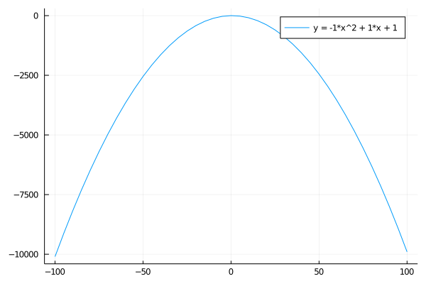

# computorv1
Project from 42 School
Made with Julia language

*How it works*
- The program asks a user for a polynom of the form : 'a * X^0 + b * X^1 = c * X^2'.
- If the polynomial degree is 0, 1 or 2, it solves the polynom (if possible).
- The users are asked whether they want to print a plot of the equation (if it can be solved).

*Bonus*
- Check the number of inputs.
- Check the formatting of input for obvious errors.
- Process natural language equations (i.e. 'X + X^2 = 42').
- Visualization (only if the user asks for it).
- Visualization : asks the user for left and right limits and padding.
- Visualization : asks the user for output format (pdf of png).
- Ask the user if he wants to print the discriminant.
- If no input, ask for input.
